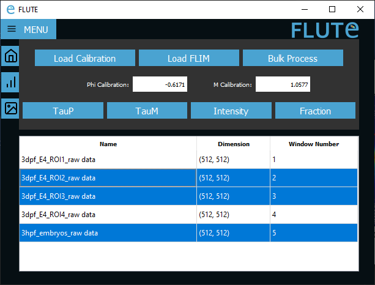
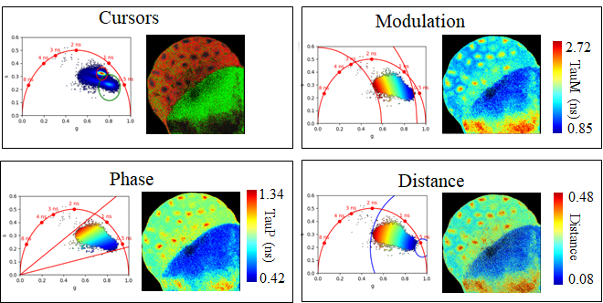

<div id="top"></div>
<!--
*** Readme based on the template here: https://github.com/othneildrew/Best-README-Template
-->

<!-- PROJECT LOGO -->
<br />
<div align="center">
  <a href="https://github.com/DaleLOB/FLUTE">
    
  </a>

  <p align="center">
    a Python GUI for interactive phasor analysis of Fluorescence Lifetime Microscopy (FLIM) data
    <br />
    <a href="https://www.cambridge.org/core/journals/biological-imaging/article/flute-a-python-gui-for-interactive-phasor-analysis-of-flim-data/862F290EC14187741BDA6B58E9868FA2"><strong>Explore the docs »</strong></a>
    <br />

  </p>
</div>

## User manual and publication

A detailed user manual is available in the supplemental material of the associated publication:
<br />
Gottlieb, D., Asadipour, B., Kostina, P., Ung, T., & Stringari, C. (2023). 
"FLUTE: A Python GUI for interactive phasor analysis of FLIM data". 
Biological Imaging, 1-22. 
    <a href="https://www.cambridge.org/core/journals/biological-imaging/article/flute-a-python-gui-for-interactive-phasor-analysis-of-flim-data/862F290EC14187741BDA6B58E9868FA2"><strong>doi:10.1017/S2633903X23000211 »</strong></a>
<br />
Please cite this article if you found FLUTE helpful with your data analysis.

<!-- ABOUT THE PROJECT -->
## About the project
<div align="center">
 
</div>

Fluorescence Lifetime Ultimate Explorer (FLUTE) provides a graphical user interface to explore Fluorescence Lifetime Microscopy (FLIM) using phasor analysis. The GUI allows for quick and interactive analysis of experimental FLIM data, and can export results for further processing. 

An example of various FLIM data visualisation and analyses can be seen here:

<div align="center">


*Colormaps of the same data with cursor selection, phase lifetime contrast, modulation lifetime contrast and distance from a known molecular species. Scale bar is 150 um.*
</div>

<p align="right">(<a href="#top">back to top</a>)</p>

The Fluorescence lifetime imaging microscopy (FLIM) data relative to the publications are in our <a href="https://zenodo.org/records/8324901"><strong>Zenodo repository »</strong></a>
<br />
Fluorescein.tif stack contains the fluorescence intensity decay of fluorescein solution with a known lifetime of 4ns, used as calibration.
Embryo.tif  file contains the fluorescence intensity decay of a zebrafish embryo at 3 days post fertilisation.
<br />
Both files have been acquired with the following parameters:
<br />
* laser repetition rates = 80 MHz
* bin width = 0.223ns
* temporal bin number = 56
<br />

Here you can find in open access <a href="https://zenodo.org/records/10839310"><strong>the slides about FLUTE software</strong></a>
<br />


### Built with

FLUTE mainly depends on the following packages:

* [PyQt](https://pypi.org/project/PyQt5/)
* [Scipy](https://scipy.org)
* [Numpy](https://numpy.org)

With the exe compiled using
```auto-py-to-exe```


<!-- GETTING STARTED -->
## Getting started

### Running the exe
To quickly start using FLUTE, an exe which works on Windows computers without installing Python is available under releases on the github [here](https://github.com/LaboratoryOpticsBiosciences/FLUTE/releases/tag/v2.0.0).

### Running the code
To run the code from this github page, run main.py after installing:

```pip install PyQt5, numpy, opencv-python, matplotlib, scikit-image```

### Prerequisites

FLIM data must be saved or exported as a tiff-stack, where each image of the stack represents a temporal bin of the fluorescence decay measurement. Example data is available in the supplemental data of the release publication.

<p align="right">(<a href="#top">back to top</a>)</p>


## License

FLUTE is Copyright (C) 2022 FLUTE

FLUTE source code is Free and Open Source Software released under the
terms of the 3-Clause BSD License (see file [LICENSE] for details).

The prebuilt FLUTE executable is a combined work that contains both
FLUTE and QT library bindings. It is released under the terms of both
the 3-Clause BSD License (for the FLUTE part) and the <a href="https://www.gnu.org/licenses/lgpl-3.0.txt"><strong>GNU Lesser General Public License </strong></a> (for the QT part).


