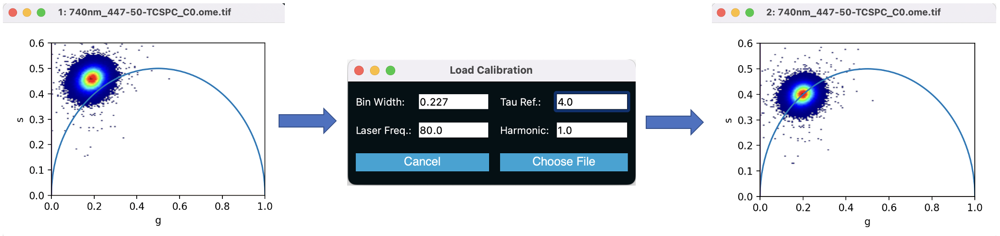
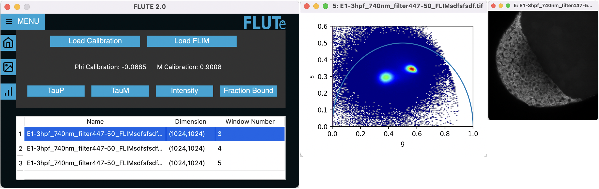
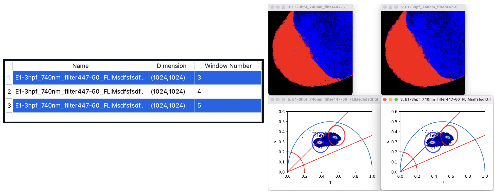
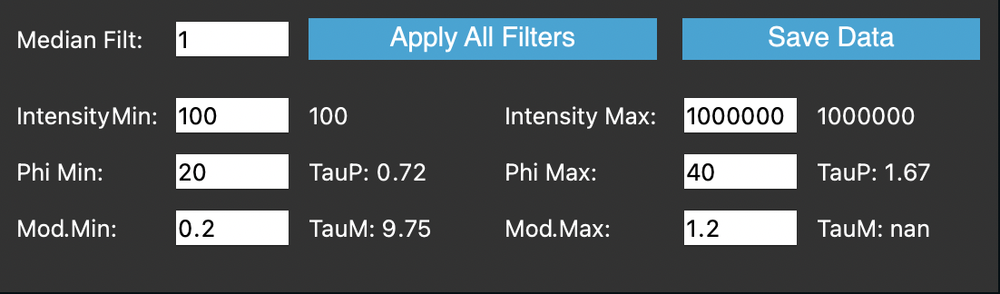
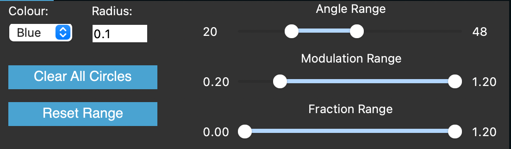

<div id="top"></div>
<!--
*** Readme based on the template here: https://github.com/othneildrew/Best-README-Template
-->

<!-- PROJECT LOGO -->
<br />
<div align="center">
  <a href="https://github.com/DaleLOB/FLUTE">
    
  </a>

  <p align="center">
    An exploration tool for FLIM data
    <br />
    <a href="https://github.com/DaleLOB/FLUTE"><strong>Explore the docs »</strong></a>
    <br />
    <br />
    <a href="https://github.com/DaleLOB/FLUTE">View Demo</a>
    ·
    <a href="https://github.com/DaleLOB/FLUTE/issues">Report Bug</a>
    ·
    <a href="https://github.com/DaleLOB/FLUTE/issues">Request Feature</a>
  </p>
</div>


<!-- ABOUT THE PROJECT -->
## About The Project

 

FLUTe (Fluorescence Lifetime Ultimate Explorer) provides a graphical user interface to explore fluorescence lifetime data user phasor plots. The tool is intended to provide quick information on the data, and to compare multiple sets of data directly. 

After the analysis, a mask of the images and the g and s coordinates of the data can be exported for further analysis using other tools. 

An example of the exported data can be seen here:


*Intensity colourmap (left), phase colourmap (middle), and modulus colourmap (right) of the same data*

<p align="right">(<a href="#top">back to top</a>)</p>


### Built With

FLUTe mainly depends on the following packages:

* [PyQt](https://pypi.org/project/PyQt5/)
* [Scipy](https://scipy.org)
* [Numpy](https://numpy.org)

<p align="right">(<a href="#top">back to top</a>)</p>


<!-- GETTING STARTED -->
## Getting Started

To quickly start using FLUTe, a single file exe for windows systems is available [here](https://example.com). 

To run the code from this github page, which also functions on Mac computers, run main.py

### Prerequisites

To run main.py, the following packages are necessary:
```python
import PyQt5
import numpy
import pickle
import PIL
import scipy
import skimage
import cv2
import matplotlib
```

Data must be saved as a tiff-stack, where each page of the stack represents the next timepoint in the fluorescence decay.

<p align="right">(<a href="#top">back to top</a>)</p>

<!-- USAGE EXAMPLES -->
## Loading Data
To analyze data, you must first calibrate the setup using data acquired of a pure fluorphore sample by clicking the "Load Calibration" button on the front panel. For example, here we used fluroscene with a known decay time of 4ns. The program adjusts the phase and the modulation to place the average decay of the sample along the proper location of the unit circle, and will apply the same offsets to all further data loaded. 

The values entered in the "Load Calibration" window are also used for opening all further datasets.



To load data, click the "Load FLIM" button on the front panel, and choose your tiff-stack image. This will open the phasor plot and a greyscale image of your data. Multiple sets of data can be opened using the same process. Calibration parameters can also be adjusted between opening each set of data, if the experiments were performed on different days.



## Interacting With Several Datasets
The table on the front panel can be used to interact with several sets of data. To select multiple sets of data, ctrl+click, and to select a range of data, shift+click. All selected datasets will have the same analysis applied, allowing for direct comparison of data.



## Colourmapping


| Command | Description |
| --- | --- |
| TauP | Colourmapping based on phase angle of flurophore |
| TauM | Colourmapping based on modulation magnitude of flurophore |
| Intensity | Either shows a greyscale image, or a jet colourmapping intensity image |
| Fraction Bound | Colourmapping based on distance from position on unit circle entered by the user |

## Thresholding



To apply filters, enter a value and click 'Enter', or click 'Apply All Filters' to apply to all selected images

| Command | Description |
| --- | --- |
| Median Filt | Applies a 3x3 convolutional median filter to the data, as explained [here](https://doi.org/10.1038/s41596-018-0026-5) |
| Intensity Min/Max | Applies intensity thresholding. The value is calculated by the sum of all the images in the stack. |
| Phi Min/Max | Applies an angle threshold in degrees, and displays the associated TauP value. |
| Mod. Min/Max | Applies a distance threshold from the origin, and displays the associated TauM value. |
| Save Data | Saves the plot, raw data, and images of all colormaps. Used for exporting data for further analysis in other programs. |

## Interactivity



This page allows for better interactivity with the data using sliders and clicking on the plots.

| Command | Description |
| --- | --- |
| Circle color / Radius | When the circle is selected, you can click on the plot to highlight an area on the image with a solid color fill.  |
| Angle/Modulation/Fraction Range | Sliders to coarsely adjust the corresponding values from the "thresholding" pane |
| Clear circles | Removed circles placed on the plot |
| Reset range | Removes the range thresholds from the data |

## Working Principle

FLUTe is based on the phasor analysis presented here:

<a id="1">[1]</a> 
Chiara Stringari, Amanda Cinquin, Olivier Cinquin, Michelle A. Digman, Peter J. Donovan, & Enrico Gratton (2011). Phasor approach to fluorescence lifetime microscopy distinguishes different metabolic states of germ cells in a live tissue. Proceedings of the National Academy of Sciences, 108(33), 13582-13587.

where the g and s coordinates are found by taking the fourier transform of the decay data, and plotting with the real components on the x, and the imaginary components on the y. 


